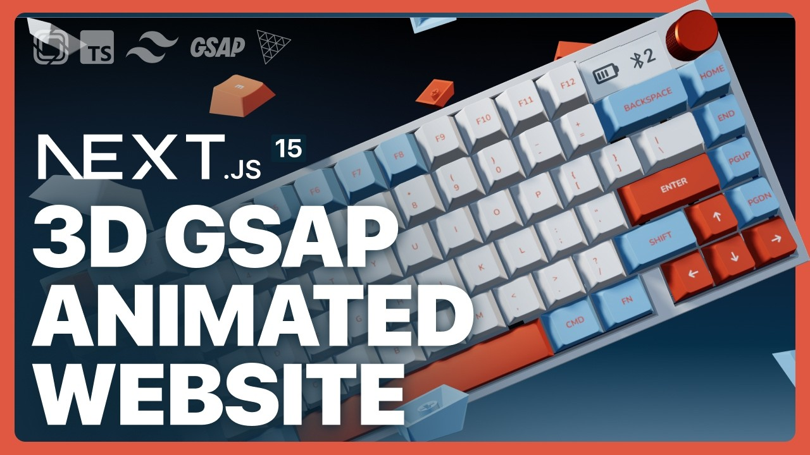

<div align="center">
  <br />
  <a href="https://github.com/Itssanthoshhere/Nimbus-Keyboard-3D" target="_blank">
    
  </a>
  <br />

  <div>
    
    
    
    
    
    
    
    
    
    
  </div>

  <div align="center">
    <h3>⌨️ Nimbus Keyboards</h3>
    An interactive, modern keyboard showcase with <b>3D animations</b> using <b>Next.js 15, TailwindCSS, Prismic CMS, and React Three Fiber</b>.<br/>
    <i>Built step by step with Slice Machine and GSAP for smooth animations.</i>
  </div>

  <br />

  <a href="https://nimbus-keyboard-3-d.vercel.app/" target="_blank">
    
  </a>
  <br />
</div>

---

## 📋 Table of Contents

1. ✨ [Introduction](#introduction)
2. ⚙️ [Tech Stack](#tech-stack)
3. 🔋 [Features](#features)
4. 🤸 [Quick Start](#quick-start)
5. 🧱 [Project Structure](#project-structure)
6. 📝 [Customization](#customization)
7. 📄 [License](#license)
8. 🔗 [Contacts](#contacts)

---

## ✨ Introduction

Nimbus Keyboards is a **3D interactive keyboard showcase** website. Users can explore keyboard models, switch types, and keycaps in 3D with smooth animations. The site leverages **Next.js 15**, **TailwindCSS**, **Prismic CMS**, and **React Three Fiber** to deliver immersive interactions and content-driven layouts.

---

## ⚙️ Tech Stack

#### ⚡ Framework & Core

- **[Next.js 15](https://nextjs.org/)** – Full-stack React framework for SSR, SSG, and ISR.
- **React 19 (RC)** – Component-based UI library.
- **TypeScript 5** – Static typing for safer, maintainable code.

#### 🎨 Styling & UI

- **[Tailwind CSS 3.4](https://tailwindcss.com/)** – Utility-first CSS framework.
- **Fluid Tailwind** – Responsive fluid typography & spacing.
- **clsx** – Conditional class management for dynamic styling.
- **React Icons** – Ready-to-use icon sets.

#### 📦 CMS & Content

- **[Prismic CMS](https://prismic.io/)** – Headless CMS for managing dynamic content.
  - `@prismicio/client`, `@prismicio/react`, `@prismicio/next` – Prismic SDKs for Next.js integration.

- **Slice Machine** – Local custom type & slice builder for content modeling.

#### 🎬 Animation

- **[GSAP 3.12](https://greensock.com/gsap/)** – Timeline-based animations for smooth transitions.
- **@gsap/react** – GSAP integration with React components.

#### 🖼 3D & Visualization

- **[Three.js 0.171](https://threejs.org/)** – 3D rendering engine.
- **React Three Fiber** – React renderer for Three.js.
- **[@react-three/drei](https://github.com/pmndrs/drei)** – Helpers & controls for React Three Fiber.

#### 🧹 Tooling

- **ESLint** + `eslint-config-next` – Linting and code quality.
- **PostCSS** – CSS processing.
- **Turbopack** – Fast local dev server (`next dev`).

---

## 🔋 Features

- **Landing Page** – Hero section with immersive 3D keyboard.
- **3D Keyboard Models** – Rotate, zoom, and interact with keyboard layouts.
- **Switch Playground** – Explore switches in 3D for tactile comparison.
- **Keycap Changer** – Visualize custom keycap sets in real-time.
- **Dynamic Content** – Manage content via Prismic CMS.
- **Smooth Animations** – Powered by GSAP timelines and ScrollTrigger.
- **Responsive Design** – Desktop, tablet, and mobile friendly.

---

## 🤸 Quick Start

### Prerequisites

- [Git](https://git-scm.com/)
- [Node.js](https://nodejs.org/en/)
- [npm](https://www.npmjs.com/)

### Clone the Project

```bash
git clone https://github.com/Itssanthoshhere/Nimbus-Keyboard-3D.git
cd Nimbus-Keyboards
```

### Install Dependencies

```bash
npm install
```

### Run Development Server

```bash
npm run dev
```

Visit [http://localhost:3000](http://localhost:3000) to view the project.

---

## 🧱 Project Structure

| File/Component           | Description                                         |
| ------------------------ | --------------------------------------------------- |
| `app/layout.tsx`         | Layout wrapper and global providers                 |
| `app/page.tsx`           | Homepage rendering                                  |
| `slices/*/index.tsx`     | Prismic slice components                            |
| `components/Bounded.tsx` | Layout wrapper with consistent padding              |
| `components/Navbar.tsx`  | Header navigation bar with menu and checkout button |
| `components/Footer.tsx`  | Footer with links and branding                      |
| `components/Loader.tsx`  | Loader animation for 3D canvas                      |
| `components/Scene.tsx`   | 3D scene for keyboards using React Three Fiber      |

---

## 📝 Customization

### Add Pages & Slices

1. Open [Prismic Dashboard](https://prismic.io/dashboard)
2. Create a new **Page**
3. Add slices (heading, body, 3D components)
4. Publish and view at `/your-page-slug`

### Preview Content

Supports Prismic **Preview Mode** for local dev.
🔗 [Preview Drafts in Next.js](https://prismic.io/docs/technologies/preview-content-nextjs)

---

## 🔗 Contacts

- GitHub: [Itssanthoshhere](https://github.com/Itssanthoshhere)
- LinkedIn: [Santhosh VS](https://www.linkedin.com/in/thesanthoshvs/)

---

## 📄 License 

This project is for **educational purposes only** and is **not affiliated with or endorsed by** [Prismic](https://www.linkedin.com/company/prismic-io/), Next.js, or any other third-party tools mentioned. 

#### 🎥 Inspired by the tutorial: 
**Learn Next.js 15, GSAP, Three.js and Prismic to build a 3D skateboard website** by **Prismic** 

📺 [Watch on YouTube](https://youtu.be/R7l4uVMWRF0?si=c-CCvosQyEWFlcmb) 

All trademarks and assets belong to their respective owners.

---

#### ⭐ Show Your Support

If you liked this project, **give it a ⭐** and share it with your network!

---

